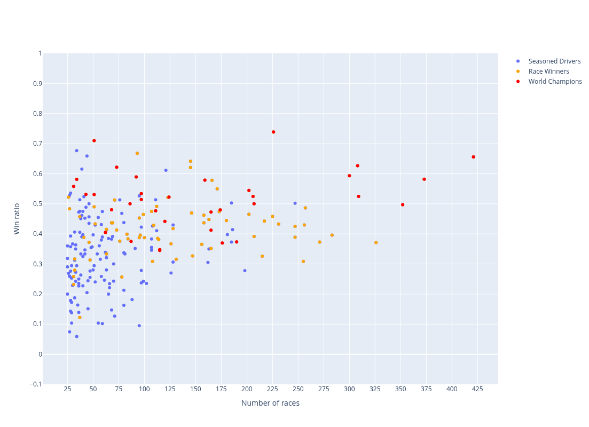
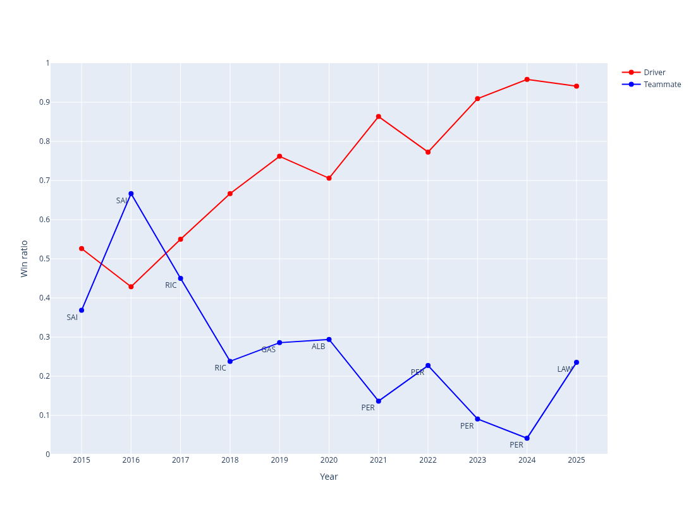
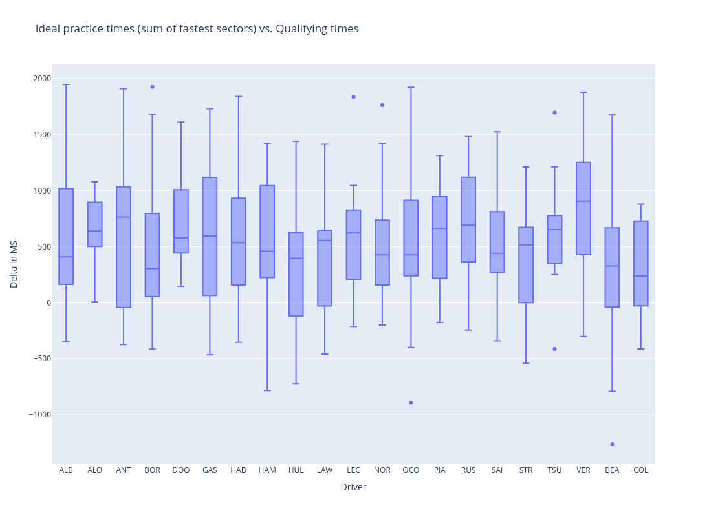

<p align="center">
    
</p>

<h1 align="center">
  F1 Analysis
</h1>

<p align="center">
  Exploratory Formula 1 data analysis and visualization
</p>

<p align="center">
  <a href="#contents">Contents</a> |
  <a href="#installation">Installation</a> |
  <a href="#getting-started">Getting started</a> |
  <a href="#development">Development</a>
</p>

## Contents

| Notebook                               | Description                                              | Preview                                                              |
|----------------------------------------|----------------------------------------------------------|----------------------------------------------------------------------|
| `01_drivers_vs_teammate.ipynb`         | General comparison of driver's win ratios vs teammates   |          |
| `02_notable_drivers_vs_teammate.ipynb` | Comparing single driver's winratios vs their teammates   |  |
| `03_practice_vs_qualifying.ipynb`      | Relationship between practice and qualifying performance |       |

## Installation

1. Make sure you have [poetry](https://python-poetry.org/) installed on your system.

2. Clone this repository with `git clone https://github.com/FjellOverflow/f1-analysis.git`.

3. Run `poetry install`.

## Getting started

All data analysis happens in the Jupyter notebooks in the `notebooks` directory. They are numbered for a recommended sequence, but you’re welcome to explore them in any order you prefer.

```sh
# run jupyter to explore all notebooks
poetry run jupyter notebook notebooks

# or run a specific notebook with
poetry run jupyter notebook notebooks/01_drivers_vs_teammate.ipynb
```

## Development

1. Make sure to install the project with its development dependencies

```sh
poetry install --with dev
```
2. Install the recommended extensions for _VSCode_, by opening the _Extensions_ tab and typing `@recommended`.

The repository ships with pre‑configured tools to keep the codebase consistent:

- [sqlfluff](https://www.sqlfluff.com/) to format SQL scripts
- [ruff](https://docs.astral.sh/ruff/) for Python/Jupyter files
- [pyrefly](https://pyrefly.org/) for Python type checking

A [pre-commit](https://pre-commit.com/) hook runs the above tools, as well as [nb-clean](https://github.com/srstevenson/nb-clean) before each commit. If any style violations are detected, the commit is blocked until they are resolved.